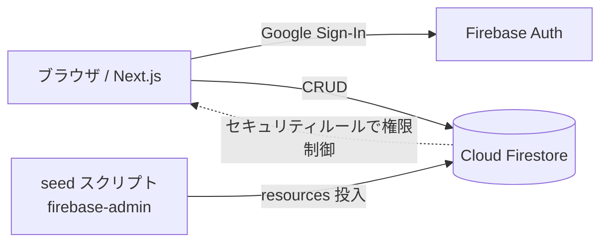

# Room & Booth Booking

会議室・フォンブースを予約する小規模オフィス向けの予約システム（PoC / ポートフォリオ）。
日単位のタイムグリッドから空きスロットを選んで予約でき、同一リソースの時間帯重複は自動でブロックします。

> 汎用サンプルとして一から実装したものです。特定企業のデータ・レイアウト・社内システムには依存しません。

## ライブデモについて

https://room-booking-portfolio.vercel.app で公開しています。Googleログイン後のデータは
**全ログインユーザーで共有**されます（訪問者ごとの分離なし）。予約は本人のものだけ編集・削除できますが、
デモ用途のため予告なくデータをリセットする場合があります。

## 主な機能

- 🔐 Googleアカウントでのログイン（Firebase Authentication）
- 🗓️ 日ビューのタイムグリッド（リソース横並び・30分スロット）
- ✅ 予約作成／自分の予約のキャンセル
- ⛔ 時間帯の重複予約を防止（純関数でロジックを分離・テスト済み）
- 🔒 Firestore セキュリティルールで「自分の予約しか編集・削除できない」を担保

## 技術スタックと選定理由

| 領域 | 採用 | 理由 |
|---|---|---|
| フロント | Next.js 16 (App Router / TypeScript) | 型安全・App Routerで見通しの良い構成 |
| スタイル | Tailwind CSS | 小規模UIを素早く一貫したデザインで実装 |
| 認証 | Firebase Authentication | Googleログインを最小実装で導入 |
| DB | Cloud Firestore | 予約データのリアルタイム性・無料枠・ルールでの権限制御 |
| テスト | Vitest | 競合判定ロジックのユニットテスト |

## アーキテクチャ



## データモデル

- `resources/{id}` … 予約対象（会議室・フォンブース）: `name, type, capacity, location, active`
- `bookings/{id}` … 予約: `resourceId, userId, userName, title, start, end, createdAt`

競合判定は UI/DB に依存しない純関数（`lib/overlap.ts`）に切り出し、`lib/__tests__/overlap.test.ts` でカバーしています。

## セットアップ

### 1. 依存インストール

```bash
npm install
```

### 2. Firebase プロジェクト準備

1. [Firebase Console](https://console.firebase.google.com/) で無料プロジェクトを作成
2. Authentication → Sign-in method → **Google** を有効化
3. Firestore Database を作成（本番モード）
4. プロジェクトの設定 → マイアプリ（Web）を追加し、設定値を控える

### 3. 環境変数

```bash
cp .env.local.example .env.local
# .env.local に Firebase の設定値を入力
```

### 4. セキュリティルール適用

`firestore.rules` の内容を Firebase Console の Firestore → ルール に貼り付けて公開。

### 5. 初期データ投入

サービスアカウント鍵（プロジェクトの設定 → サービスアカウント → 新しい秘密鍵）を
`serviceAccountKey.json` として保存（コミット禁止・`.gitignore`済み）。

```bash
GOOGLE_APPLICATION_CREDENTIALS=./serviceAccountKey.json npm run seed
```

### 6. 起動

```bash
npm run dev      # http://localhost:3000
npm test         # 競合判定ロジックのテスト
npm run build    # 本番ビルド
```

## デプロイ

Firebase Hosting か Vercel にデプロイ可能。環境変数（`NEXT_PUBLIC_FIREBASE_*`）を
デプロイ先に設定すればそのまま動作します。

## ライセンス

MIT
